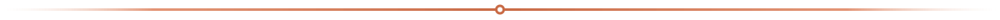
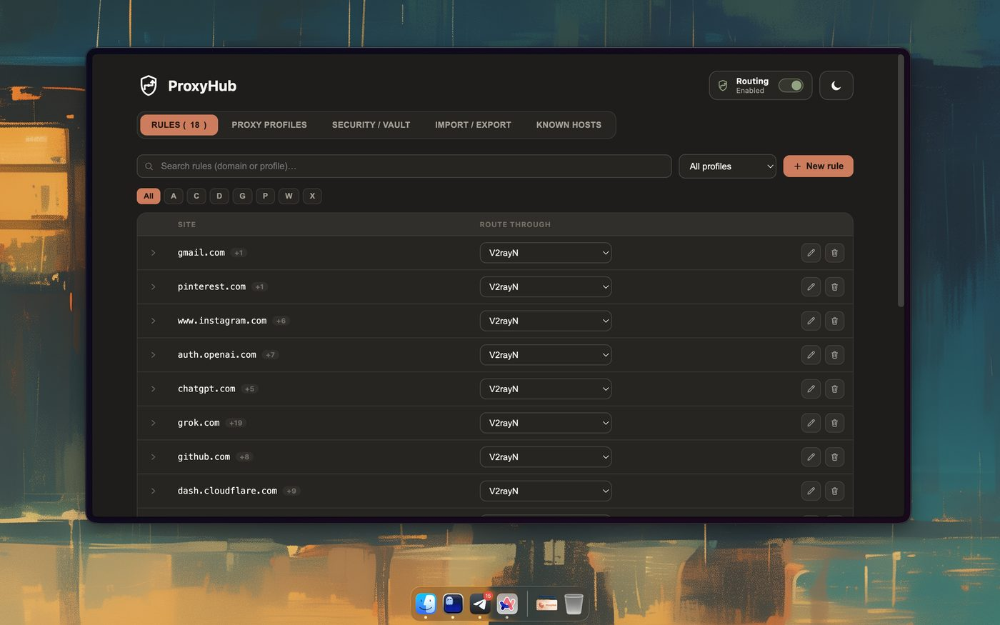
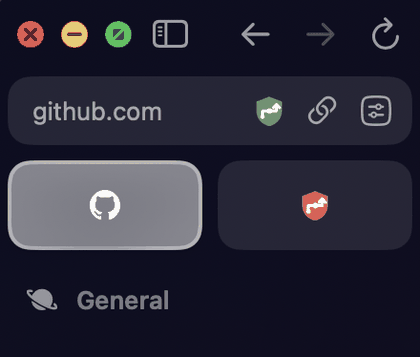
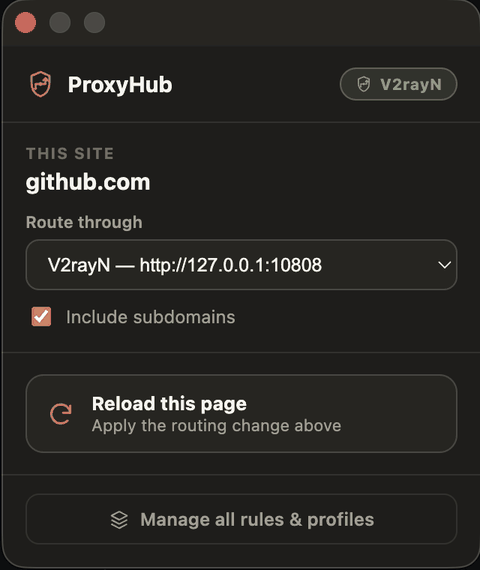

  

#  ProxyHub — Per-Site Proxy Switcher

 &nbsp;  &nbsp;  &nbsp;  &nbsp; 

> نسخه فارسی این راهنما موجود است: [README.fa.md](README.fa.md)

  

**ProxyHub** is a Chrome extension that lets you route a proxy **per website**, instead of
turning one proxy on or off for your entire browser. Pick a site, choose which proxy it
should go through, and everything else — related CDN domains, broken images, rule
management — is handled for you.

No technical background needed: install it, follow the built-in walkthrough, and you're done.

###  Table of Contents

- [Screenshots](#screenshots)
- [Features](#features)
- [Install](#install)
- [How to use it](#how-to-use-it)
- [Good to know](#good-to-know)
- [Support the Project — Donate](#support-the-project--donate)

  

## Screenshots

  
   Manage all your rules and proxy profiles from the full options page.

<table>
<tr>
<td width="50%" align="center" valign="top">

 The toolbar icon shows at a glance whether ProxyHub is routing the current site.
</td>
<td width="50%" align="center" valign="top">

 Pick a proxy for the current tab, right from the toolbar popup.
</td>
</tr>
</table>

  

##  Features

- **One proxy per site** — YouTube through one proxy, another site through another, and
  everything else loading normally. No more switching a single global proxy on and off.
- **Smart domain suggestions** — big sites load images/video from separate CDN domains.
  When you add a site ProxyHub recognizes, it offers to add those related domains too, so
  thumbnails and video don't silently break.
- **Fixes broken pages for you** — if something on a page fails to load because a domain
  isn't covered yet, a small banner appears offering to add the missing rule and reload.
- **Clear toolbar icon** — glance at the toolbar to see whether the current tab is proxied,
  direct, or routing is off — no need to open the popup just to check.
- **Handles thousands of rules** — search, filters, and bulk import/export if you manage a
  lot of sites.
- **Optional encrypted vault** — if your proxy needs a username/password, you can lock them
  behind a master passphrase instead of storing them in plain text.
- **Dark & light themes.**

  

##  Install

### Option A — Chrome Web Store
*(Coming soon — this section will be updated with the store link once it's published.)*

### Option B — Manual install (works today, in any Chromium browser: Chrome, Edge, Brave, Arc, Opera)

1. Download this repository — click the green **Code** button above → **Download ZIP**,
   then unzip it (or `git clone` it if you're comfortable with Git).
2. Open `chrome://extensions` in your browser.
   For Brave, use `brave://extensions`, and similarly for Arc and Edge:
   `arc://extensions` and `edge://extensions`.
3. Turn on **Developer mode** (top-right toggle).
4. Click **Load unpacked** and select the unzipped `ProxyHub` folder.
5. Pin the extension icon to your toolbar so it's always one click away.

That's it — a welcome guide opens automatically the first time, walking you through
everything with pictures.

  

##  How to use it

1. **Add a proxy** — open the extension's *Options* page → *Proxy profiles* → add your
   proxy's address, port, and login if it needs one. You only do this once per proxy.
2. **Pick a site** — click the ProxyHub icon while on any website, choose which proxy
   profile to route it through, then reload the page. Leave it on *Direct* for sites you
   don't want to proxy.
3. **Read the icon** — the toolbar icon always tells you the current tab's state at a
   glance:
   -  **Proxied** — this tab is going through a proxy
   -  **Direct** — no rule, loads normally
   -  **Off** — routing is paused everywhere
4. **Let it help you** — if a site needs extra CDN domains, or a page has broken
   images/scripts, ProxyHub will offer a one-click fix.

  

##  Good to know

- A single domain can only be routed one way at a time — if two different sites you've
  added both load assets from the very same generic CDN domain, that domain follows
  whichever rule was created first.
- Safari isn't supported: Apple doesn't allow browser extensions to control proxy settings
  at all, so this isn't something that can be added later — it's a platform limitation.
- **License**: free for personal use and modification. Commercial use is not permitted
  without a separate written agreement with the author — see [LICENSE](LICENSE) for details.

  

##  Support the Project — Donate

If ProxyHub has been useful to you, consider supporting its continued development.
Every contribution, big or small, is deeply appreciated. 

 

| Network | Address |
|:---|:---|
|  | `UQDPxrimgBU6Mil0dhDn0Fc303RLRXKr9hGGDu7bTEBdGGqs` |
| -FF060A?style=flat-square&logo=tron&logoColor=white) | `TXix7uf6JPUKvWeUbA4A7wmQLVKnDbLRQU` |
| -3C3C3D?style=flat-square&logo=ethereum&logoColor=white) | `0x1FC907d3396460f1Cd94E3BC48564b1b46b70026` |

 

> Thank you for keeping this project alive. 

